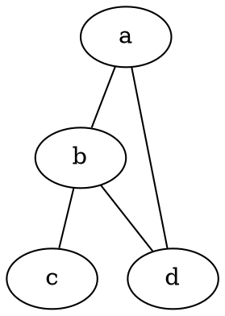
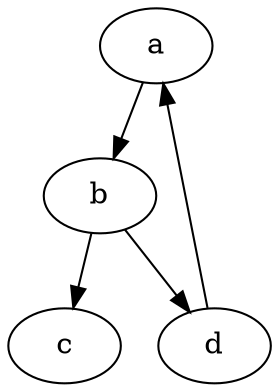
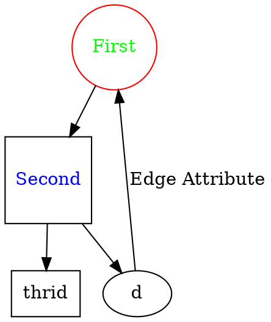
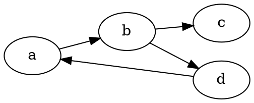
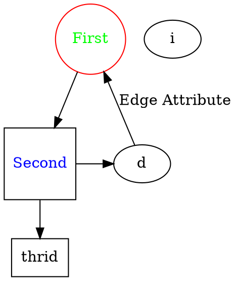
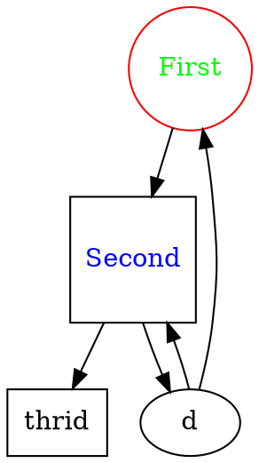
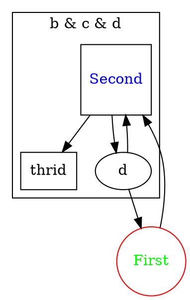
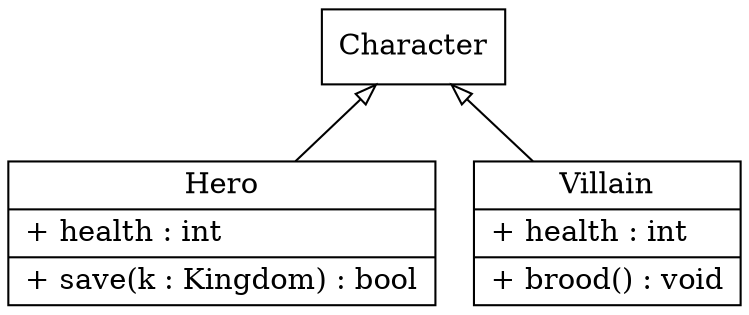

## 前言

[Graphviz](http://graphviz.org/about/)是一个“所见即所想”的绘制有向图，无向图的工具。它使用了布局算法对节点位置进行自动排版，可以导出为jpg，svg，pdf等不同格式，使用dot语言作为绘图指令。

了解关于dot文件的指令，可以使用``man dot``查询到更多，比如dot, neato, circo。

## 安装

Mac 系统使用：``$ brew install graphviz``

Ubuntu 系统使用：``$ sudo apt-get install graphviz``

## 快速开始

### 无向图
创建一个dot语言脚本文件并命名为`demo.dot`：



我们将使用该脚本绘制一个无向图，创建一个Makefile文件：

```
demo.jpg:demo.dot
	dot -Tjpg demo.dot -o demo.jpg

clean:
	rm demo.jpg
```

然后在同一个目录下执行``make``指令，可以看到graphviz为我们输出了一个jpg格式的文件。

EXTRA: 如果将Makefile中的指令替换为``circo -Tjpg demo.dot -o demo.jpg``，可以得到一个不同的layout的输出图像。

### 有向图

再来绘制一个有向图，需要注意的是无向图使用``graph``关键字来定义，而有向图使用``digraph``关键字来定义，同时需要使用``->``来表示图上边的方向：



### 节点与边的属性

如果希望在图上显示节点的属性或者边上的属性，可以分开记录节点的属性和节点的关系：



所有的属性的可选项可以在[这里](https://www.graphviz.org/doc/info/attrs.html)找到。

### 排版方向

如果你不希望图的分布是从上到下的而是从左到右的，可以更改代码为：



### Rank

Graphviz使用rank系统来对图进行排序，即一个节点的rank大于指向它对最大rank的节点的rank，因此一个有向图中最大的rank的那个节点在最底部。如果希望改变rank值来改变分布，可以使用类似于``{rank=same b d}``的指令：



这是b和d节点会被排列到同一条水平线上。

### [Subgraph](https://renenyffenegger.ch/notes/tools/Graphviz/elems/subgraph/index)

Subgraph在graph中用一对花括号来标示。



如果subgraph的名字使用``cluster``开头，那么它就是一个[cluster](https://renenyffenegger.ch/notes/tools/Graphviz/elems/cluster/index)，一个不是cluster的subgraph只有一个属性可以设置``rank``。

cluster会在周围有一个方形边框，你可以给cluster设置一个名字：



### Records

Node形状中的``record``非常适合用于创建UML图，例如：



## 参考链接
* [Official DOT Documentation](https://graphviz.gitlab.io/_pages/doc/info/lang.html)
* [graphviz教程](https://blog.csdn.net/mcgrady_tracy/article/details/47132485)
* [Quick Introduction to graphviz](https://www.worthe-it.co.za/programming/2017/09/19/quick-introduction-to-graphviz.html)
* [VSCode Markdown Enhanced Previewed 支持在markdown文件中插入dot文件代码块来画图](https://shd101wyy.github.io/markdown-preview-enhanced/#/diagrams)
