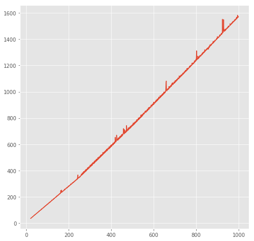
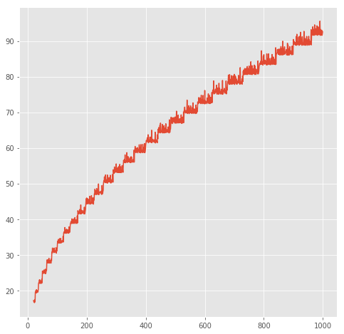
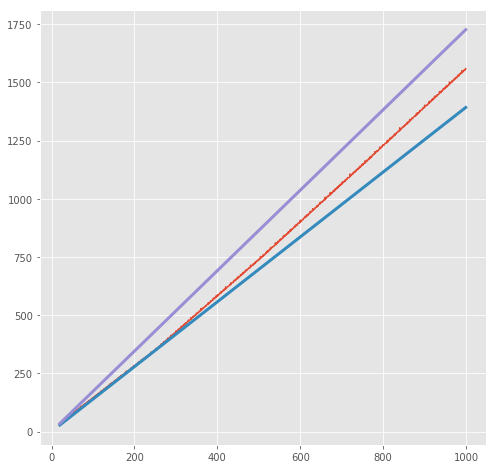
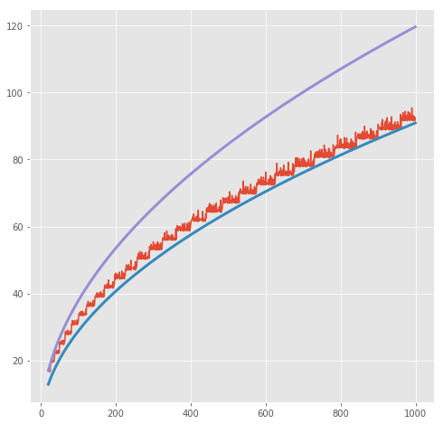
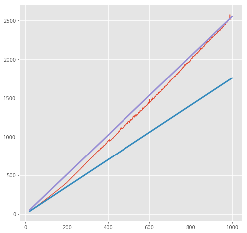
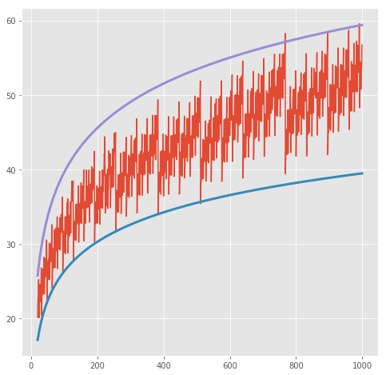

## 前言

Order of Growth 是一个根据根据函数问题大小来估算消耗计算资源上下界的方法。比如对一个list用一个循环求和会与list大小呈正比例线性关系，即使有一定的波动，它也一定会在一定的范围内。这个Order of Growth和算法本身相关。其定义为：

A method for bounding the resources used by a function by the "size" of a problem.

**n**: size of the problem

**R(n)**: measurement of some resource used (time or space)

$$
R(n) = \Theta(f(n))
$$

means that there are positive constants **k1** and **k2** such that:

$$
k_1 \cdot f(n) \le R(n) \le k_2 \cdot f(n)
$$

for all **n** larger than some minimum **m**.

这里用**factors**和**factors_fast**两个简单的函数举例：要想求得一个整数n的所有factor，函数**factors**的方法是遍历从
1到n的所有数字，**factors_fast**的方法是遍历从1到$$\sqrt{n}$$的整数。后者显然循环步数更少，具体来说，它们的growth或者说复杂度分别为：

Name | Time | Space
---|---|---|
factors | $$\Theta(n)$$ | $$\Theta(n)$$
factors_fast | $$\sqrt{n}$$ | $$\sqrt{n}$$ 

这两个函数的实现分别为：


```python
from math import sqrt

def divides(k, n):
    """Return  whether k evenly divides n."""
    return n % k == 0

def factors(n):
    """Count the positive integers that evenly divide n.
    
    >>> factors(576)
    21
    """
    total = 0
    for k in range(1, n+1):
        if divides(k, n):
            total += 1
    return total

def factors_fast(n):
    """Count the positive integers that evenly divide n.
    
    >>> facotrs_fast(576)
    21
    """
    sqrt_n = sqrt(n)
    k, total = 1, 0
    while k < sqrt(n):
        if divides(k, n):
            total += 2
        k += 1
    if k * k == n:
        total += 1
    return total
```

可以绘图来观察steps和n的变换。下面的代码可以实现这个功能，其中``repeat``可以重复调用函数来计算平均时间，代码中调用的给**factor**的参数范围是20到10000，每次调用25取中位数然后循环后再取中位数。y轴的单位是微秒。


```python
%matplotlib inline
import matplotlib.pyplot as plt
plt.style.use('ggplot')

from timeit import repeat
from numpy import median, percentile

def plot_times(name, xs, n=25, order=None):
    f = lambda x: name + '(' + str(x) + ')'
    g = globals()
    
    samples = []
    for _ in range(n):
        times = lambda x: repeat(f(x), globals=g, number=1, repeat=n)
        samples.append([median(times(x)) for x in xs])
    ys = [10e6 * median(sample) for sample in zip(*samples)]
    
    plt.figure(figsize=(8, 8))
    plt.plot(xs, ys)
    
    if order:
        slopes = [y / order(x) for (x, y) in zip(xs, ys)]
        for slope in (percentile(slopes, 0.2), percentile(slopes, 99.8)):
            plt.plot(xs, [slope * order(x) for x in xs], linewidth=3)
```


```python
args = range(20, 1000)
```


```python
plot_times('factors', args)
```





```python
plot_times('factors_fast', args)
```





可以看到**factors**呈一个线性关系，而**factors_fast**呈一个曲线关系，我们可以画出它们的上下界：


```python
plot_times('factors', args, order=lambda x:x)
```





```python
plot_times('factors_fast', args, order=sqrt)
```





另一个例子是**exp**和**fast_exp**。要计算一个b的n次方，**exp**方法是用循环从1乘到n：

$$
b^n =
\begin{cases}
1 & \text{if n = 0} \\
b \cdot b^{n-1} & \text{otherwise}
\end{cases}
$$

而**fast_exp**使用了一个更加聪明的方法：

$$
b^n = 
\begin{cases}
1 & \text{if n = 0} \\
(b^{\frac{1}{2}n}) ^2 & \text{if n i even} \\
b \cdot b^{n-1} & \text{if n is odd}
\end{cases}
$$

它们的growth对比为：

Name | Time | Space
---|---|---|
exp | $$\Theta(n)$$ | $$\Theta(n)$$
fast_exp | $$\Theta(\log(n))$$ | $$\Theta(\log(n))$$ 


```python
def exp(b, n):
    """
    >>> fast_exp(2, 10)
    1024
    """
    if n == 0:
        return 1
    return b * exp(b, n-1)

def square(x):
    return x*x

def fast_exp(b, n):
    """
    >>> fast_exp(2, 10)
    1024
    """
    if n == 0:
        return 1
    elif n % 2 == 0:
        return square(fast_exp(b, n//2))
    else:
        return b * fast_exp(b, n-1)
```


```python
from functools import partial
pexp = partial(exp, 2)
pfast_exp = partial(fast_exp, 2)
```

同样的，我们可以画出它们的曲线和上下界：


```python
plot_times('pexp', args, order=lambda x:x)
```





```python
from numpy import log
plot_times('pfast_exp', args, order=log)
```





# Comparing orders of growth (n is the problem size)

下面是一些经典的order of growth：

* $$\Theta(b^n)$$: Exponential growth, recursive fib takes $$\Theta(\phi^n)$$ steps, where $$\phi = \frac{1+\sqrt{5}}{2} \approx 1.61828$$. Incrementing the problem scales R(n) by a factor
* $$\Theta(n^2)$$:  Quadratic growth, E.g., overlap, Incrementin n increases R(n) by the problem size n.
* $$\Theta(n)$$: Linear growth, E.g., slow factors or exp
* $$\Theta(\sqrt{n})$$: E.g., fast factors
* $$\Theta(\log n)$$: Lograithmic growth, E.g., fast exp. Doubling the problem only increments R(n).
* $$\Theta(1)$$: Constant. The problem size doesn't matter

## 参考

* [cs61A Lecture18 Video8](https://www.bilibili.com/video/av20538548/?p=108)
