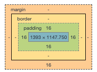

## Add CSS

### External CSS

```html
<!DOCTYPE html>
<html>
<head>
<link rel="stylesheet" type="text/css" href="mystyle.css">
</head>
<body>

<h1>This is a heading</h1>
<p>This is a paragraph.</p>

</body>
</html>
```

### Internal CSS

```html
<!DOCTYPE html>
<html>
<head>
<style>
body {
  background-color: linen;
}

h1 {
  color: maroon;
  margin-left: 40px;
}
</style>
</head>
<body>

<h1>This is a heading</h1>
<p>This is a paragraph.</p>

</body>
</html>
```

### Inline CSS

```html
<!DOCTYPE html>
<html>
<body>

<h1 style="color:blue;text-align:center;">This is a heading</h1>
<p style="color:red;">This is a paragraph.</p>

</body>
</html>
```

## CSS Layout

如果希望实现下面的布局，可以使用不同的方法实现：


### 1. [``position``](http://learnlayout.com/position.html) example

```css
.container {
  position: relative;
}
nav {
  position: absolute;
  left: 0px;
  width: 200px;
}
section {
  /* position is static by default */
  margin-left: 200px;
}
footer {
  position: fixed;
  bottom: 0;
  left: 0;
  height: 70px;
  background-color: white;
  width: 100%;
}
body {
  margin-bottom: 120px;
}
```

### 2. [``float``](http://learnlayout.com/float.html) example

Float is intended for wrapping text around images

```css
nav {
  float: left;
  width: 200px;
}
section {
  margin-left: 200px;
}
```

### 3. [``inline block``](http://learnlayout.com/inline-block.html) example

```css
nav {
  display: inline-block;
  vertical-align: top;
  width: 25%;
}
.column {
  display: inline-block;
  vertical-align: top;
  width: 75%;
}
```

### 4. [``flexbox``](http://learnlayout.com/flexbox.html) example
```css
.container {
  display: -webkit-flex;
  display: flex;
}
nav {
  width: 200px;
}
.flex-column {
  -webkit-flex: 1;
          flex: 1;
}
```

### 要点
* ``display`` property：``display`` 属性可以是``block``（``div``是典型的block元素），``inline``（``span``是典型的inline元素）, ``none``（``script``的none元素，和``visibility:hidden``不同，none类型的元素会在渲染阶段当作该元素不存在，但是如果只是hidden，该元素仍然会占有和原来一样的位置）。更多介绍见[这里](https://developer.mozilla.org/en-US/docs/CSS/display)。

* HTML元素从里到外包裹着padding, border, margin。默认在设置这些padding，  border, margin之后，会在原来的元素外面扩张导致元素总体面积变大，如果希望保持元素总体面积不变，可以设置[box-sizing](http://learnlayout.com/box-sizing.html)：
    ```css
    * {
    -webkit-box-sizing: border-box;
        -moz-box-sizing: border-box;
            box-sizing: border-box;
    }
    ```


    
* [clearfix](http://learnlayout.com/clearfix.html) float属性的元素如果和在同一行的元素高度不一样，下边界会不对齐，可以通过设置下面属性解决：
    ```css
    .clearfix {
    overflow: auto;
    }
    ```
* [media query](https://developer.mozilla.org/en-US/docs/Web/CSS/Media_Queries/Using_media_queries) 响应式设计可以帮助网站内容在不同的设备上（比如手机，桌面站点）用不同的样式进行展示。
* [meta viewport](https://dev.opera.com/articles/an-introduction-to-meta-viewport-and-viewport/)另一种响应式设计的方法。
* [three-column](http://learnlayout.com/column.html)可以帮助完成三列垂直布局。
    ```css
    .three-column {
    padding: 1em;
    -moz-column-count: 3;
    -moz-column-gap: 1em;
    -webkit-column-count: 3;
    -webkit-column-gap: 1em;
    column-count: 3;
    column-gap: 1em;
    }
    ```
* [More about flexbox](https://bocoup.com/blog/dive-into-flexbox)
* [CSS frameworks](http://learnlayout.com/frameworks.html)

## 参考

* [How to Add CSS](https://www.w3schools.com/css/css_howto.asp)
* [Learn CSS Layout](http://learnlayout.com/)

