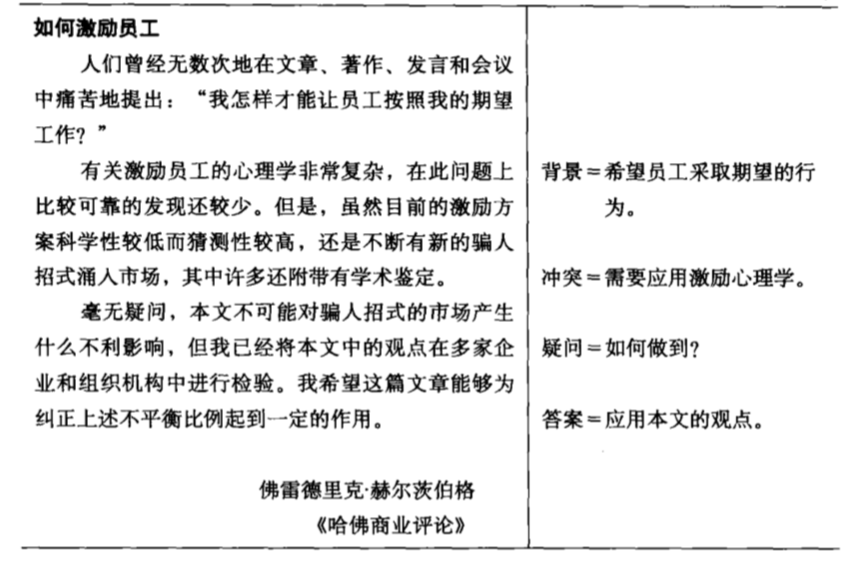
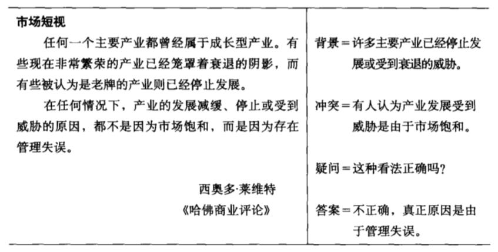

> 文章写作，语言沟通中有一个清晰的内容逻辑结构可以让对方很容易地理解你想表达的内容，同时也可以帮助自己整理对一个话题的理解。一个最简单的内容逻辑结构就是“金字塔结构”。金字塔结构是一个递归的结构，它将最抽象的观点和声明放在顶部，然后在下一级补充支持性的观点，每一个支持性观点又继续受到再下一级的观点的支持。顶部的观点能够自动激起对方的疑问，之后下一级的观点会回答读者心中的问题，这样的问答思维模式可以帮助读者或者听众和作者之间的有效沟通。

## 为什么学习金字塔原理？

在宣传文案，科技论文，视频影片中，有些作品会被观众认为逻辑严肃，易于理解，那么这些作品为什么更受到欢迎？《金字塔原理》一书为写作和思考问题提出了一个通用的框架模式：金字塔原理。金字塔原理是一个包含逻辑关系的金字塔型文章结构。


这样的结构有下面多个好处：
* 利用金字塔原理有助于提高写作效率。
    - 与其从头至尾线性地写完一篇文章，通过先列出金字塔的结构再进行内容填充，可以有效减少内容修改的次数，并使得金字塔每一块之间逻辑顺畅。
* 理解金字塔原理的人在阅读金字塔模式的文章时会更加快速。
    - 人的大脑在处理复杂任务的时候的处理能力其实有限，研究表明大脑平均同时记住7样东西，有的人最多记住4-5样，所以面对文章内容中数百行的句子，将它们进行组合是方便于理解的。一次性记住葡萄，牛奶，土豆，鸡蛋，胡萝卜，橘子，咸鸭蛋，苹果，酸奶这9样东西是困难的，但是如果将它们分组到水果，蔬菜，蛋奶这3类分组记忆会轻松很多。
    - 金字塔结构自上而下的机构让文章先表达结论，读者可以通过金字塔顶部结论快速确定对文章内容是否是自己想要的，省去了读完整篇文章再总结的时间。
* 金字塔原理是逻辑严谨的对话的基础。
    ```
    读者：为什么说猪很漂亮？
    切斯特顿：猪很漂亮，因为猪很肥，而且具有典型的英国特征。
    读者：肥胖有什么漂亮的？
    切斯特顿：肥胖能够使得其他人显得苗条，也能够使得肥胖者更谦虚（因为有人比他还胖）。
    读者：为什么具有典型的英国特征就漂亮呢？
    切斯特顿：猪于大地是互相连接的；这种连接说明权力与仁慈并非不能共存；这种态度是很符合英国特点的，也非常美好，足以成为英国的国家象征。
    ```

    这段对话中就包含了这样一个金字塔模型，读者顺着切斯特顿的回答的逻辑提出问题，让整个中心思想得以表达完整。

## 金字塔的结构

金字塔结构中最顶层是文章内容的中心思想，金字塔总纵向方向上为抽象关系，横向方向上为逻辑关系，包括演绎逻辑（deduction）和归纳逻辑（induction）。

### 纵向关系

### 横向关系

### 序言的结构

* 背景（Situation）
* 冲突（Complication）
* 疑问（Question）
* 回答（Answer）





通过大量阅读和写作文章，你可能会发现文章大体是在回答以下四类问题：

1. 我们应该做什么？
2. 我们应该如何做？
3. 我们是否应该这样做？
4. 为什么会发生这样的事情？

## 如何构建金字塔

### 自上而下方法

### 自下而上方法

## Reference

* The Minto Pyramid Princeple: Logic of Writing, Thinking and Problem Solving
