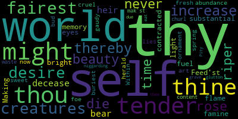
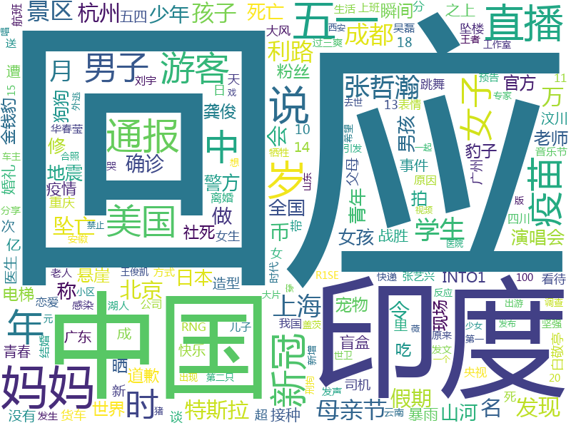
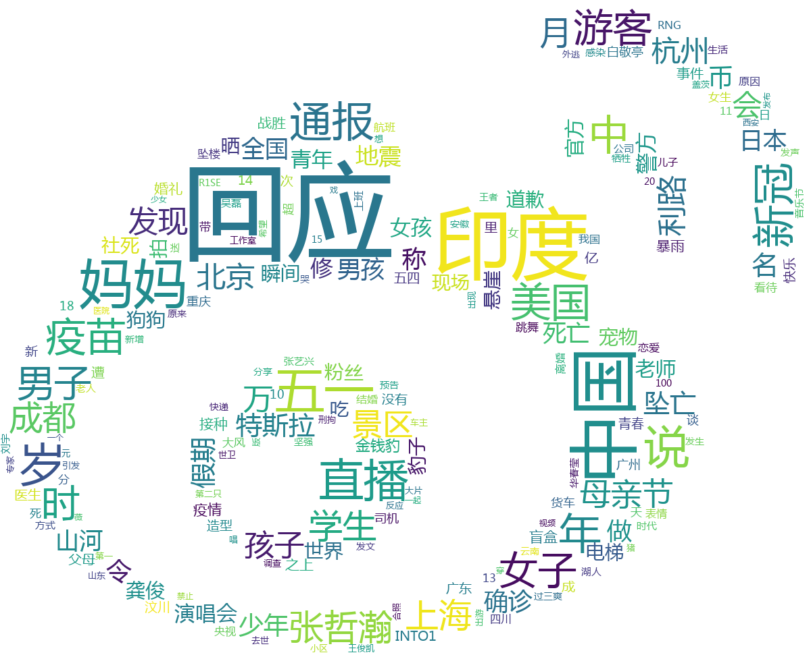
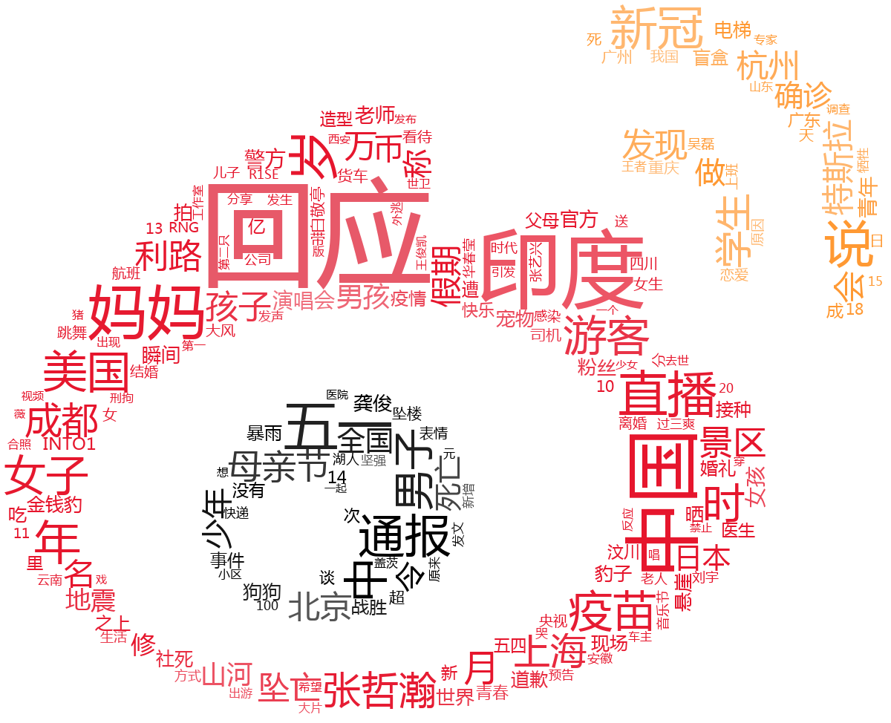

> 词云图片将一组词语排列到一张图片内，并根据词频来设置词语的大小，它是可视化文本数据的重要方法。本篇文章将会介绍如何使用 Python 的第三方库 wordcloud 来生成新浪热搜词语的词云图片，并自定义词云图片的字体，尺寸，颜色，形状。

## 前言

词云图片用一系列词语来组成一个形状，同时词频大的词会显示得更大，词频小的词会显示得更小，这样会形成一种主题词概览的效果。词云可以在项目介绍，活动总结，数据分析，工作汇报可以作为大量数据的可视化的一个有效手段。

Python中的第三方库``wordcloud``可以帮助用户用较短的代码从文本数据生成词云图片，并且可以进行个性化格式修改，比如改变词云图片的字体，颜色，形状。本篇文章的下面内容会介绍如何使用``wordcloud``生成新浪热搜内容的词云图片并进行个性化格式的修改。

## 安装``wordcloud``库

首先需要使用包管理器``pip``安装[``wordcloud``](https://amueller.github.io/word_cloud/)：

```
pip install wordcloud
```

如果需要改变词云的形状，你还需要安装``imageio``库：

```
pip install imageio
```

## 第一张词云图片

使用``wordcloud``可以使用很短的代码来绘制出一张词云图片。首先准备相关文字，这里使用Shakespeare的一首诗，然后创建一个``WordCloud``对象``w``，使用其中的``generate``方法，将指向文本内容的参数``text``传入其中，这是``WordCloud``会自动统计词频，最后使用``to_file``方法可以将图片保存到指定路径。

```python
import wordcloud
w = wordcloud.WordCloud()
text = """
From fairest creatures we desire increase,
That thereby beauty's rose might never die,
But as the riper should by time decease,
His tender heir might bear his memory:
But thou contracted to thine own bright eyes,
Feed'st thy light's flame with self-substantial fuel,
Making a famine where abundance lies,
Thy self thy foe, to thy sweet self too cruel:
Thou that art now the world's fresh ornament,
And only herald to the gaudy spring,
Within thine own bud buriest thy content,
And tender churl mak'st waste in niggarding:
Pity the world, or else this glutton be,
To eat the world's due, by the grave and thee.
"""
w.generate(text)
w.to_file('output.png')
```



这样就可以得到第一个词云图片，可以看到最常见的词的尺寸会更大，不常见的词会更小。但是目前的词云图片的背景颜色，字体，尺寸不一定能够满足实际的需求，因此还需要进一步调整来完成定制化的词云图片。

## 配置图片尺寸，背景色和字体

为了改变词云的背景色，字体，和图片尺寸，需要在构建``WordCloud``对象的时候就传入对应的参数：

```python
import pickle
counter = pickle.load(open('./counter.pkl', 'rb'))

with open('cn_stopwords.txt', encoding='utf-8') as f:
    for word in f:
        word = word.strip()
        if word in counter:
            counter.pop(word)

w = wordcloud.WordCloud(
    width=800,
    height=600,
    background_color='white',
    font_path='msyh.ttc',
)

w.generate_from_frequencies(counter)
w.to_file('output.png')
```

在这段代码中使用中文字体微软雅黑创建了一个白色背景的微博热搜的词云图片。其中在创建``WordCloud``类的时候，传入了宽度``width``，高度``height``，将背景颜色``background``设置为白色，指定了字体的路径``font_path``为``msyh.ttc``，你可以在网上下载得到这个字体。微博热搜词语的词频可以在[这里](/assets/2021-05-16-python-wordcloud/counter.pkl)下载得到。为了不然一些没有语义内容的停顿词显示在词云图片当中，还需要从表示词频的字典中将所有出现在``cn_stopwords.txt``的词都去掉。你可以从WordCloud的[文档](https://amueller.github.io/word_cloud/)查询到更多用于词云定制化的参数。



## 指定词云图片的形状

将词云嵌入到一个与主题相关的形状中通常会放在一个矩形的形状中更加吸引人，比如新浪热搜的词云图片嵌入在logo当中会更加符合主题。为了实现这个效果，首先使用``imageio``库中``imread``函数读取sina的logo图片，需要设置``WordCloud``对象中的``mask``参数为读取后的图片。这个图片将会被作为mask生成指定形状的词云图片，其中白色的部分不会出现词语，其他颜色的部分会被词语填充。

```python
# 读取本地图片sina.jpeg，作为词云形状图片
mk = imageio.imread("./sina.png")

w = wordcloud.WordCloud(
    width=800,
    height=600,
    background_color='white',
    font_path='msyh.ttc',
    mask=mk,
)
```



## 填充词云的颜色

``wordcloud``库不仅可以生成指定形状的词云，还可以给词云图片填充指定的颜色。为了填充指定颜色，需要使用``ImageColorGenerator``函数从上一节的mask得到一个颜色生成函数，然后调用w中的``recolor``方法，就可以对词云图片填充颜色。这里可以对比一下原来的sina的logo图片和制作后的词云图片。

```python
from wordcloud import ImageColorGenerator

w.generate_from_frequencies(counter)

# 调用wordcloud库中的ImageColorGenerator()函数，提取模板图片各部分的颜色
image_colors = ImageColorGenerator(mk)
w.recolor(color_func=image_colors)
```




## 结语

本篇文章介绍了如何使用python的``wordclud``库从文本或者词频字典中生成词云图片，并进行背景色，字体，图片尺寸，词云形状，填充颜色的调整，从而得到一个定制化的词云图片。但是这里的例子是用了一个经过处理的词频字典来生成的，实际制作中，原始数据通常还需要结合其他自然语言处理的库，比如``jieba``，``snownlp``来进行分词，词性标注的处理从而得到干净的数据。如果有时间的话还可以进一步探索如何从头编写一个[词云图片算法](https://stackoverflow.com/questions/342687/algorithm-to-implement-a-word-cloud-like-wordle)。

## 参考

* [WordCloud for Python documentation](https://amueller.github.io/word_cloud/)
* [Python 词云可视化 - 王陸](https://www.cnblogs.com/wkfvawl/p/11585986.html)
* [WordCloud using custom colors](https://amueller.github.io/word_cloud/auto_examples/a_new_hope.html)
