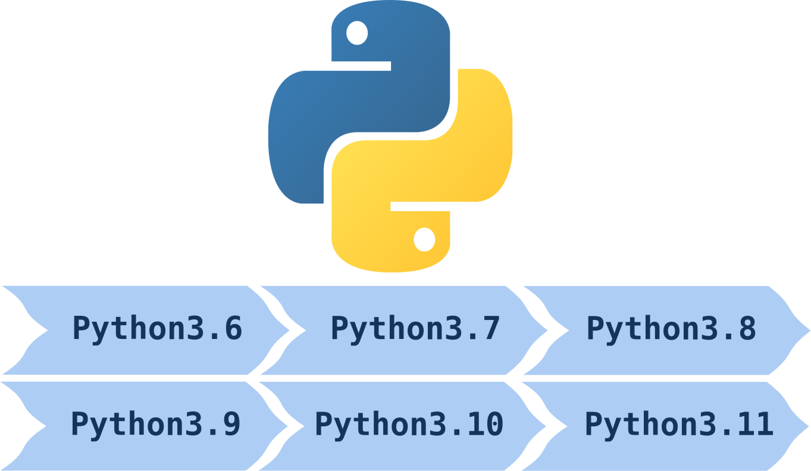

> 本博客持续收集 Python 新版本中值得注意的功能。包括 Python3.8 开始的海豹运算符，Python3.10 的match语句，更好的rrror message等。

## Python3.6

### f-string

TODO

## Python3.7

### dataclass

TODO

## Python3.8

### 海豹运算符（Python Assignment Expression）

海豹运算符``:=``是 python3.8 引入的最大的改变。海豹运算符的功能是在evalute experssion的时候能够完成assignment。因为这个符号长得很像[海豹](https://en.wikipedia.org/wiki/Walrus)的眼睛和牙齿，因此被称为海豹运算符，官方称这个运算符为 assignment expression operator。

> 在Python中，一串代码被称为 statement，而 expression 是特殊的 statement，它可以被 evaluate 为一个值。例如 ``a = 1+2``是一句 statement，它将数值3赋值给变量``a``，其它的 statment 比如 return statement 和 import statement；而``1+2``是一句 expression，它可以被评估为数值3，在 REPL 中运行的时候会打印出3。

为了快速理解海豹运算符的语法，可以打开REPL输入下面的代码：

```python
>>> walrus = 3
>>> walrus
3

>>> (walrus := 3)
3
>>> walrus
3

>>> walrus := 3
  File "<stdin>", line 1
    walrus := 3
           ^^
SyntaxError: invalid syntax
```

在第一个语句中，代码使用了传统的赋值语句将数值3赋值给了变量walrus；在第二段的代码中，数值3不仅赋值给了变量而且语句会返回3；第二段的代码中报出了语法错误，因为使用海豹运算符的语句需要使用括号包裹起来才能运行。（在if语句中括号可以省略）

海豹运算符没有为python提供额外的功能，所有原来代码能够实现的功能现在也能够实现，但是海豹运算符提供了一些情况下代码结构上的便利，并且方便了和代码的交互。下面介绍一些海豹运算符的使用案例。

首先是用于Debugging。假设你正在计算一个公式，比如计算一个圆的面积，其中圆的半径是从另外一个公式计算而来。如果希望检查公式中计算半径的过程是否出错，你可以重组代码，将半径计算部分复制粘贴出来，或者你可以使用海豹计算符给中间的表达式一个命名。这样就能在保持原有的计算过程，不破坏代码的同时得到中间公式的值，避免了重组代码可能产生的bug。

```python
>>> import math
>>> total = 100
>>> area = math.pi * (width := total / 10) ** 2
>>> width
10.0
>>> area
314.1592653589793
```

另一个使用情况是在list或者dict的构建中，一些重复执行的代码会被重复执行，可以使用海豹运算符对其进行修改优化。比如下面的例子实现了一个简单的[wc](https://en.wikipedia.org/wiki/Wc_%28Unix%29)程序功能，但是可以发现其中``path.read_text()``被执行了多次，因此文件内容被读取了多次。

```python
# wc.py

import pathlib
import sys

for filename in sys.argv[1:]:
    path = pathlib.Path(filename)
    text = path.read_text()
    counts = [
        text.count("\n"),  # Number of lines
        len(text.split()),  # Number of words
        len(text),  # Number of characters
    ]
    print(*counts, path)
```

进行如下的修改，可以在读取完文件内容后将其保存在``text``变量，在列表的后面的元素中也可以重复使用：

```python
# wc.py

import pathlib
import sys

for filename in sys.argv[1:]:
    path = pathlib.Path(filename)
    counts = [
        (text := path.read_text()).count("\n"),  # Number of lines
        len(text.split()),  # Number of words
        len(text),  # Number of characters
    ]
    print(*counts, path)
```

List comprehension是python代码的一个特色，你可以简洁清晰地写出想要的功能，而且使用list comprehension会运算更快。但是在有些情况下使用list comprehension会引入不必要的计算。例如下面的例子中，代码希望实现寻找找到大于5的数字然后加倍，但是这样的语法让``double``函数对每个满足条件的数字执行了2次，这时不必要的开销。

```python
numbers = [6, 3, 2, 4, 1, 7, 0, 6]

results = [double(num) for num in numbers if double(num) > 5]
```

这时你可以使用海豹运算符，将``double``计算得到的结果保存到变量，只有满足大于5的条件的值会被保留。这当然可以用多行代码来实现同样的效果，但是海豹运算符在这里保留了list comprehension的简洁性。

```python
results = [value for num in numbers if (value := double(num)) > 5]
```

在 while 循环中，你需要在 while 关键词后面检查循环的中止条件，如果要检查的变量需要提前进行设置，就会导致语法上非常奇怪，例如下面询问用户输入的代码例子。这里两句包含``input``函数的代码是同样的作用，第一个``input``的作用是在循环初始的时候询问用户的输入，在循环体中的``input``也是必要的，因为需要在用户输入不合理的时候持续询问用户输入。但是这样就让循环体变复杂的时候代码难于维护。

```python
question = "Will you use the walrus operator?"
valid_answers = {"yes", "Yes", "y", "Y", "no", "No", "n", "N"}

user_answer = input(f"\n{question} ")
while user_answer not in valid_answers:
    print(f"Please answer one of {', '.join(valid_answers)}")
    user_answer = input(f"\n{question} ")
```

如果希望代码更易于阅读管理，这样的循环结构通常为改为下面的方式，使用``break``来设置退出循环的条件。

```python
while True:
    user_answer = input(f"\n{question} ")
    if user_answer in valid_answers:
        break
    print(f"Please answer one of {', '.join(valid_answers)}")
```

不过使用海豹计算符可以在这里做地更好，下面的代码更加紧凑，而且没有重复的语句。

```python
while (user_answer := input(f"\n{question} ")) not in valid_answers:
    print(f"Please answer one of {', '.join(valid_answers)}")
```

这里再介绍一个使用案例witnesses和counterexamples。当使用python中的``any()``函数检查一系列元素的时候，如果有元素检查结果为True，这个元素被称为witness；当使用``all()``函数检查一系列元素的时候，如果有元素检查结果为False，这个元素被称为counterexample。但是``any()``和``all()``函数只会返回是否有元素为witness和counterexample。例如找寻列表中是否有偶数：

```python
>>> lst = [1, 3, 4, 7, 8]
>>> any(num % 2 == 0 for num in lst)
True
```

如果希望检车这个偶数值具体为多少，就需要添加更多行的代码。但是海豹计算符可以用很小的改动满足这个需求：

```python
>>> lst = [1, 3, 4, 7, 8]
>>> any((witness := num) % 2 == 0 for num in lst)
True
>>> witness
4
```

这里witness变量就捕捉到了第一个偶数，需要注意的是``any()``函数在捕捉到第一个偶数的时候就会退出函数过程。

海豹计算符可以在python代码中带来一些语法上的方便，这些功能使用原来版本的代码也能够实现同样的功能。在保证代码可读性和可维护性的前提下，可以尝试海豹计算符对代码的改善。

## Python3.9

TODO

## Python3.10

[Python3.10](https://www.python.org/downloads/release/python-3100/)于2021年10月4日发布，这一版本添加了很多新功能，你可以在[官方文档](https://docs.python.org/3.10/whatsnew/3.10.html)找到全部的功能，这里对3.10中最值得注意的功能做一下介绍。

### Match语句（Structural Pattern Matching）

Python语句中一直没有类似于c语言的switch ... case 这样的语法，3.10版本加入了``match``语句可以实现这样的功能，并且能够实现更多。``match``语句或者称为Structral Pattern Matching在3个PEP（[Python Enhancement Proposals](https://www.python.org/dev/peps/pep-0001/#what-is-a-pep)）中有介绍，你可以在这些介绍里找到很多开发背景和说明，这里对``match``语句的重要部分做出介绍。

1. PEP 634: Specification
2. PEP 635: Motivation and Rationale
3. PEP 636：Tutorial

在没有``match``语法之前，python中使用``if...elif...elif...else``这样的语法来实现多个多个选择分支结构，同时需要使用``isinstance(x, cls)``, ``hasattr(x, "attr")``, ``len(x) == n``, 或者``"key" in x``这样的判断语句（guard）来验证变量x是否满足进入某一个分支进行计算的条件。例如判断一个人的名字是3个部分（first, mid, last）还是2个部分（first, last）的代码需要写成如下的形式：

```python
name = ['a', 'b', 'c']
if isinstance(name, tuple) and len(name) == 3:
    first, mid, last = name
    print(f'Hi, {first} {mid} {last}')
elif isinstance(name, tuple) and len(name) == 2:
    first, last = name
    print(f'Hi, {first} {last}')
```

同样的功能可以用``match``语法编写完成，而且代码会更加具有可读性。这是因为``match``语句在匹配的时候自动完成了下面几个任务：

* 它会匹配name是否是一个序列，即list或者tuple；
* 它会根据name的长度进行匹配，3个部分的名字进入一个分支，2个部分组成的名字进入另一个分支；
* 变量name中不同的部分被绑定到了变量first, last或者first, mid, last。

```python
name = ['a', 'b', 'c']
match name:
    case first, last:
        print(f'Hi, {first} {last}')
    case first, mid, last:
        print(f'Hi, {first} {mid} {last}')
```

到目前为止介绍的功能仅仅是python3.10中structral pattern matching中的sequence matching部分。``match``语句还支持更多pattern的匹配，这里是所有支持的pattern的类型：

* Sequence patterns：如上介绍，可以来匹配序列结构例如tuple和list，需要注意的是你也可以使用``[first, *rest]``这样的语法来[解包](https://realpython.com/python-kwargs-and-args/#unpacking-with-the-asterisk-operators)序列；
* Capture patterns: 可以绑定值到变量，在上面的例子中也已经体现出来了；
* Mapping patterns: 可以匹配字典类型的数据结构；
* AS patterns: 绑定subpattern的值到变量；
* OR patterns: 可以匹配不同的subpattern；
* Wildcard patterns：匹配任何情况；
* Class patterns: 匹配class数据；
* Value patterns: 匹配attribute中存储的数值；
* Literal patterns：匹配literal数值。

Mapping pattern可以匹配字典类型的数据。为了理解这点可以使用下面的例子。假设我们得到了一个用户的信息并且以字典的形式存储，我们希望使用代码来解析这部分数据然后组合成一个问候语，那么可以编写：

```python
info = {
    'name': ['a', 'b', 'c'],
    'age': 18
}
match info:
    case {'name': [first, mid, last], 'age': int(age)}:
        print(f'Hi {first mid last}, this is your {age}th year on Earth!')
    case _:
        print('Info is in invalid format!')
```

这里``{'name': [first, mid, last], 'age': int(age)}``将字典变量``info``中存储的数据进行解析并且赋值到了first，mid，last，和age。其中``int(age)``限制了age变量必须为整数才能匹配，这时class patterns的应用。``_``是通配符符号即wildcard patterns，如果所有其它case都不能匹配是将会选择这条分支进行运行。

Or patterns允许匹配两个或者更多的subpatter，例如age变量可以是int或者str，那么可以写成``int(age) | str(age)``。

Guards机制允许给pattern添加额外的限制，只有当限制满足的时候才会被匹配，这是只用pattern匹配不能做到的。例如希望筛选age大于18的信息才被打印出来，可以在case中写成``case  {'name': [first, mid, last], 'age': int(age)} if age > 18:``，这样当前的18岁的个人信息就不能匹配然后允许下面的代码。需要注意的是，guards只能对case语句添加而不能对subpattern添加。

Literal patterns匹配literal数值，它对于用变量的值来选择分支非常有用，相对于其它匹配方法更适合根据数据的结构来匹配。下面的代码是literal pattern的一个例子：

```python
def greet(name):
    match name:
        case "A":
            print("Hi, A!")
        case _:
            print("Howdy, stranger!")
```

As patterns可以绑定subpattern的值到变量。Literal pattern匹配的情况是数值上的限制，不能像数据结构上的限制那样绑定到变量，使用``as``关键字就可以在数值限制的情况下绑定变量。例如：

```python
def greet(name):
    match name:
        case "A" as name:
            print(f"Hi, {name}!")
        case _:
            print("Howdy, stranger!")
```

Value patterns匹配attribute中存储的数值。比如匹配类中的attribute的代码例子为：

```python
def handle_reply(reply):
    match reply:
        case (HttpStatus.OK, MimeType.TEXT, body):
            process_text(body)
        case (HttpStatus.OK, MimeType.APPL_ZIP, body):
            text = deflate(body)
            process_text(text)
        case (HttpStatus.MOVED_PERMANENTLY, new_URI):
            resend_request(new_URI)
        case (HttpStatus.NOT_FOUND):
            raise ResourceNotFound()
```

Structural Pattern Matching让Python在处理多分支的代码的时候能够写出更可读和易于维护的代码，例如斐波那契数列可以写成：

```python
def fib(arg):
    match arg:
        case 0:
            return 1
        case 1:
            return 1
        case n:
            return fib(n-1) + fib(n-2)
```

对树结构的遍历可以写成如下形式。虽然加入了新的``match``关键字，但是功能上仍然是向后兼容的，可以在遇到兼容性问题时候考虑使用第三方工具进行转换。

```python
def traverse(node):
    match node:
        case Node(left, right):
            traverse(left)
            traverse(right)
        case Leaf(value):
            handle(value)
```

### Zip函数中添加变量长度检查选项

``zip()``是python的内建函数，可以用来从多个序列中将元素组合起来。但是如果函数输入的序列的长度不一致，zip函数会选择最短的序列长度作为组合后的序列的长度，这会导致一些不容易发现的bug。Python3.10对zip函数引入了新的可选参数``strict``，来在对序列的长度进行runtime test。

```python
lh = list(range(10))
rh = list(range(4))

print(list(zip(lh, rh, strict=True)))

# while strict=False
# [(0, 0), (1, 1), (2, 2), (3, 3)]

# with strict=True
# Traceback (most recent call last):
#   File "/home/lab/test.py", line 21, in <module>
#     print(list(zip(lh, rh, strict=True)))
# ValueError: zip() argument 2 is shorter than argument 1
```

### Debug信息包含行号

Python3.10在程序出错时候会提供更准确和有价值的信息。例如这里故意编写一个错误的代码：

```python
# ...
print(88*'*)
# ...
```

之前的版本会报错为：

```python
  File "/home/lab/test.py", line 16
    print(88*'*)
                ^
SyntaxError: EOL while scanning string literal
```

Python3.10会报错为：

```python
  File "/home/lab2033/test.py", line 16
    print(88*'*)
             ^
SyntaxError: unterminated string literal (detected at line 16)
```

你可一看到SyntaxError会包含检测到的行号，告诉你准确的错误是字符串没有闭合，而且会使用``^``来指出错误的位置。

同时报错信息中引入了[DidYouMean](https://github.com/SylvainDe/DidYouMean-Python)机制，对于一些拼写错误的代码做出更好的提示。例如：

```python
>>> pint
Traceback (most recent call last):
  File "<stdin>", line 1, in <module>
NameError: name 'pint' is not defined. Did you mean: 'print'?
```

### Typing hint 允许使用 ``X | Y`` 语法

Python3.10对[类型检查](https://realpython.com/python-type-checking/)带来了新的功能，包括：

* PEP 604：允许使用 ``X | Y`` 语法
* PEP 613：Explicit Type Aliases
* PEP 647: User-Defined Type Guards
* PEP 612: Parameter Specification Variables

其中PEP 604可能是影响最广泛的改进。之前在进行类型检查的时候如果一个变量可能使用两个不同的数据类型时候，可以使用Union type：

```
from typing import List, Union

def mean(numbers: List[Union[float, int]]) -> float:
    return sum(numbers) / len(numbers)
```

PEP 604之后，这种情况的语法可以更加简洁，你可以写成：

```python
def mean(numbers: list[float | int]) -> float:
    return sum(numbers) / len(numbers)
```

## Python 3.11

2022年10月25日python发布了3.11版本，下面是一些重要的新特性：

Faster Python，相对于python3.10平均提高了25%，根据任务不同可以提升10%到60%

更好的错误提示。现在错误不仅回提示到行号，一行语句中哪里错了还会用`^`标志出来

```python
Traceback (most recent call last):
  File "distance.py", line 11, in <module>
    print(manhattan_distance(p1, p2))
          ^^^^^^^^^^^^^^^^^^^^^^^^^^
  File "distance.py", line 6, in manhattan_distance
    return abs(point_1.x - point_2.x) + abs(point_1.y - point_2.y)
                           ^^^^^^^^^
AttributeError: 'NoneType' object has no attribute 'x'
```

在except块中可以使用add_note()函数添加提示

异常组（except group）和`except*`语法。异常组让异常可以按组合并和同时抛出。新的`except*`语法可以匹配异常组的子组。

新的type hint，包括 LiteralString , Self, Required, NotRequired

新模块tomllib

在asyncio中添加了TaskGroup

## 参考

1. <https://realpython.com/python-walrus-operator>
2. <https://realpython.com/python39-new-features>
3. <https://realpython.com/python310-new-features>
4. <https://docs.python.org/3.11/whatsnew/3.11.html>