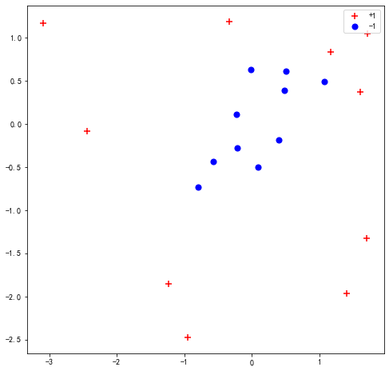
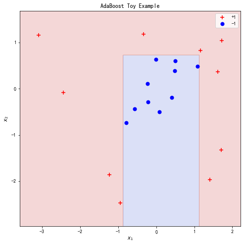
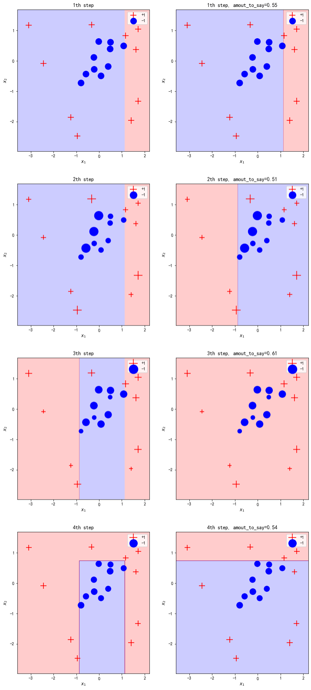

> Boosting 算法的思想在于组合许多相对较弱的模型，从而让它们的判断更加准确。AdaBoost 是由 Freund 和 Schapire 提出的第一个具有实用性的 boosting 算法。本博客介绍 boosting 算法的原理和 python 代码的实现，使用多个简单的决策树和AdaBoost算法来组合成一个更强大的模型。

## 简介

对于二元分类的任务，一个弱分类器只能取得稍高于1/2的准确率，即仅仅比随机预测稍微少一些。但是 Freund and Schapire 发现组合多个弱分类器可以作为一个强大的分类器，他们发明了第一个流行的 Boosting 算法名称为 AdaBoost （Adaptative Boosting）。本博客会介绍 AdaBoost 如何将多个深度为1的决策树组合成一个强大的分类器，并通过Python从头实现。同时介绍Gradient Boosting Machine和它的一些改进。

## AdaBoost

### AdaBoost 的算法流程

AdaBoost 算法可以组合多个简单的决策树（或者称为stump）来形成准确的判断。组合决策树的思想和 Random Forest 算法相似， 但是 AdaBoost 算法存在以下的不同点：

* Random forest 中的决策树没有深度的限制，同时也不一定是平衡的决策树；但是 AdaBoost 使用的决策树是深度为1的简单决策树；
* Random forest 算法中的每个决策树在组合判断的时候使用相同的权重；但是 AdaBoost 中的决策树有不同的权重，也就是说一些决策树的结果比另一些决策树的结果对最终预测结果的影响更大；
* Random forest 算法中的所有决策树是同时构建的；AdaBoost的决策树的构建有先后顺序，先构建的决策树会影响后构建的决策树，后构建的决策树会对先前决策树分类错误的样本加强注意。

在 AdaBoost 算法中，每个弱分类器对于样本 \\(x_i\\) 做出的预测 \\(h^s(x_i) \in {-1, 1}\\) 乘以权重 \\(\alpha^s\\)，再将多个预测相加得到最终的预测结果，-1 表示

$$
\mathrm{H}\left(x_{i}\right)=\operatorname{sign}\left(\alpha^{1} \mathrm{~h}^{1}\left(x_{i}\right)+\alpha^{2} \mathrm{~h}^{2}\left(x_{i}\right)+\cdots+\alpha^{s} \mathrm{~h}^{s}\left(x_{i}\right) \cdots\right.
$$

这\\(s\\)个弱分类模型的构建过程为：首先在第一个阶段根据数据特征寻找第一个最优的弱模型 \\(h^1(x)\\)，即 error rate 最低的模型；然后计算这个模型的权重\\(\alpha^1\\)；最后根据得到的权重对样本的权重进行调整；在后一个阶段，根据重新调整后的权重寻找第二个最优的模型，权重，并继续调整样本权重；这样的循环直到达到中止条件后停止，例如达到指定的循环数，或者所有的样本都被成功分类。

AdaBoost算法的步骤为：

1. 将所有样本的的采样权重初始化为\\(w_i^1 = \frac{1}{n}\\)
2. 进行t步骤的循环：
    1. 寻找让错误率 \\(\epsilon_{t}=\sum_{i=1}^{n} \mathbf{1}\left[h_{t}\left(x_{i}\right) \neq y_{i}\right] w_{i}^{(t)}\\) 最小的弱分类器；
    2. 设置弱分类器的权重：\\(\alpha_{t}=\frac{1}{2} \ln \left(\frac{1-\epsilon_{\ell}}{\epsilon_{t}}\right)\\)；
    3. 改变了错误分类的样本的权重：\\(w_{i}^{(t+1)}=w_{i}^{(t)} \cdot e^{-\alpha^{t} y_{i} h_{t}\left(x_{i}\right)}\\)；
    4. 重新归一化权重 \\(\sum_{i=1}^{n} w_{i}^{(t+1)}=1\\)。
3. 根据弱分类器的权重来进行预测：\\(\sum_{i=1}^{n} w_{i}^{(t+1)}=1\\)。

### 用实例动手算 AdaBoost

给定一个表格数据如下，下面来手动计算 AdaBoost 的计算过程来帮助理解。

|      | 检测1 | 检测2 | 年龄 | 诊断结果 |
| ---- | ----- | ----- | ---- | ---- |
| 1    | T     | F     | 16   | 1    |
| 2    | F     | T     | 22   | 0    |
| 3    | T     | F     | 17   | 0    |
| 4    | T     | T     | 25   | 1    |

首先建立第一个弱分类器。通过选择最小的error rate可以让第一个弱分类器使用检测器1作为根节点，只有样本2被分类错误，可以计算得到该弱分类器预测结果的error rate为\\(\frac{1}{4}\\)，接着计算该弱分类器的权重使用公式为：

$$
\alpha^s = \frac{1}{2} \log (\frac{1 - Total Error}{Total Error})
$$

可以得到\\(\alpha^1=\frac{1}{2} \ln(\frac{1 - \frac{1}{4}}{\frac{1}{4}}) = \frac{1}{2} \ln3 = 0.55\\)。这个权重的函数的特点是当total error为0的时候，权重会接近无限大，当total error为1的时候，权重会接近无限小，当total error为0.5的时候，可以认为这个分类器进行的类似于随机预测，权重会等于0。

根据该权重，我们对每个样本的权重进行调整。权重调整的目标需要对之前分类错误的样本要多加注意，因此会加强对于错误分类的样本的采样权重，同时会降低正确分类的样本的采样权重。使用的公式如下：

$$
\mathrm{w}_{i}^{s+1}= \begin{cases}\frac{\mathrm{W}_{i}^{i}}{\mathrm{~N}^{s}} e^{-\alpha^{s}} & \text { for correctly classified samples } \\ \frac{\mathrm{W}_{i}^{s}}{\mathrm{~N}^{s}} e^{+\alpha^{s}} & \text { for misclassified samples }\end{cases}
$$

其中$N^s$为一个归一化系数，它的目标是让所有权重的总和为1。经过计算可以得到分类错误的样本的权重增加到0.58，分类正确的样本的权重减少到0.14。

对于新的采样权重，可以使用 weighted gini index，或者使用使用采样权重从中采样出一个新的数据集。在第二轮的循环中，使用新的样本权重去选择最优的弱分类器，选择的范围包括检测1，检测2，年龄小于等于16，年龄小于等于17，年龄小于等于22。可以得到最优的弱分类器为年龄小于等于16，此时的error rate为0.16，\\(\alpha^2=\frac{1}{2} \ln\frac{1-0.16}{0.16}\\)。

在使用多个弱分类器预测最终结果的时候，可以使用公式\\(H(x) = 0.55 h^1(x) + 0.16 h^2(x)\\)。

### Python 实现 AdaBoost

我们可以使用``make_gaussian_quantiles``来生成一些难以被弱分类器分类的数据点：

```python
import matplotlib.pyplot as plt
from sklearn.datasets import make_gaussian_quantiles
import numpy as np
plt.rcParams['font.sans-serif'] = ['SimHei']  # 用来正常显示中文标签
plt.rcParams['axes.unicode_minus'] = False  # 用来正常显示负号

X, y = make_gaussian_quantiles(n_samples=20, n_features=2, n_classes=2, random_state=121)
y = y*2 - 1

plt.figure(figsize=(8, 8))
plt.scatter(X[y == 1][:, 0], X[y == 1][:, 1], marker='+', c='r', s=50, label='+1')
plt.scatter(X[y == -1][:, 0], X[y == -1][:, 1], marker='o', c='b', s=50, label='-1')
plt.legend()
plt.title("Data Visualization")
plt.show()
```



作为参考，可以先使用sklearn的函数实现对数据的拟合：

```python
from sklearn.ensemble import AdaBoostClassifier

bench = AdaBoostClassifier(n_estimators=4, algorithm='SAMME').fit(X, y)

def evaluate_model(X, y, clf=None):
    if clf is not None:
        pred = clf.predict(X)
        print("Error rate: {}".format((pred != y).mean()))

evaluate_model(X, y, bench)

def plot_point_and_contour(X, y, clf=None, title=None):
    x_min, x_max = X[:, 0].min()-0.5, X[:, 0].max()+0.5
    y_min, y_max = X[:, 1].min()-0.5, X[:, 1].max()+0.5

    plt.figure(figsize=(8, 8))

    if clf is not None:
        plot_step = 0.01
        xx, yy = np.meshgrid(np.arange(x_min, x_max, plot_step),
                             np.arange(y_min, y_max, plot_step))
        Z = clf.predict(np.c_[xx.ravel(), yy.ravel()])
        Z = Z.reshape(xx.shape)
        plt.contourf(xx, yy, Z, cmap='coolwarm', alpha=0.2)
        # plt.contour(xx, yy, Z, colors='black')

    plt.scatter(X[y == 1][:, 0], X[y == 1][:, 1], marker='+', c='r', s=50, label='+1')
    plt.scatter(X[y == -1][:, 0], X[y == -1][:, 1], marker='o', c='b', s=50, label='-1')
    plt.xlabel(f'$x_1$')
    plt.ylabel(f'$x_2$')
    if title is not None:
        plt.title(title)
    plt.xlim(x_min, x_max)
    plt.ylim(y_min, y_max)
    plt.legend()
    plt.show()

plot_point_and_contour(X, y, clf=bench, title='AdaBoost Toy Example')
```



下面从头实现我们自己的adaboost模型。

```python
from sklearn.tree import DecisionTreeClassifier

def adaboost_fit(X, y, num_steps=10):
    # set equal weight for each sample
    sample_weights = np.ones_like(y) / y.shape[0]
    
    stump_lst = []
    amount_to_say_lst = []
    sample_weights_lst = []
    # for each step
    for step in range(num_steps):
        sample_weights_lst.append(sample_weights)
        
        # find weak classifier has the best performance
        stump = DecisionTreeClassifier(max_depth=1, max_leaf_nodes=2)
        stump.fit(X, y, sample_weight=sample_weights)
        
        # calculate the amout-to-say for this weak classifier
        pred = stump.predict(X)
        total_error = sample_weights[(pred != y)].sum()
        print()
        amount_to_say = np.log((1 - total_error) / total_error) / 2
        
        # adjust the sample weight
        new_sample_weights = sample_weights * np.exp(-amount_to_say * y * pred)
        
        new_sample_weights /= new_sample_weights.sum()
        sample_weights = new_sample_weights
        
        stump_lst.append(stump)
        amount_to_say_lst.append(amount_to_say)
                
    return stump_lst, amount_to_say_lst, sample_weights_lst

def adaboost_predict(X, stump_lst, amount_to_say_lst):
    # sum up all the weak classifier
    stump_preds = np.array([stump.predict(X) for stump in stump_lst])
    stump_weights = np.array(amount_to_say_lst)
    out = np.sign(np.dot(stump_weights, stump_preds))
    return out

stump_lst, amount_to_say_lst, sample_weights_lst = adaboost_fit(X, y, num_steps=4)

stump_preds = np.array([stump.predict(X) for stump in stump_lst])
stump_weights = np.array(amount_to_say_lst)

# Visualize different step in adaboost
for i in range(1, 5):
    x_min, x_max = X[:, 0].min()-0.5, X[:, 0].max()+0.5
    y_min, y_max = X[:, 1].min()-0.5, X[:, 1].max()+0.5

    plt.figure(figsize=(12, 6))

    plot_step = 0.01
    xx, yy = np.meshgrid(np.arange(x_min, x_max, plot_step),
                         np.arange(y_min, y_max, plot_step))
    Z = adaboost_predict(np.c_[xx.ravel(), yy.ravel()], stump_lst[:i], amount_to_say_lst[:i])
    Z = Z.reshape(xx.shape)
    plt.subplot(121)
    if len(np.unique(Z)) == 1:
        if np.unique(Z)[0] == -1:
            colors = ['b']
        elif np.unique(Z)[0] == 1:
            colors = ['r']
    else:
        colors = ['b', 'r']
    plt.contourf(xx, yy, Z, colors=colors, alpha=0.2)

    plt.scatter(X[y == 1][:, 0], X[y == 1][:, 1], marker='+', c='r', s=50, label='+1', sizes=sample_weights_lst[i-1]*4000)
    plt.scatter(X[y == -1][:, 0], X[y == -1][:, 1], marker='o', c='b', s=50, label='-1',  sizes=sample_weights_lst[i-1]*4000)
    plt.xlabel(f'$x_1$')
    plt.ylabel(f'$x_2$')
    plt.xlim(x_min, x_max)
    plt.ylim(y_min, y_max)
    plt.legend()
    plt.title(f'{i}th step')
    
    plt.subplot(122)
    Z = stump_lst[i-1].predict(np.c_[xx.ravel(), yy.ravel()])
    Z = Z.reshape(xx.shape)
    if len(np.unique(Z)) == 1:
        if np.unique(Z)[0] == -1:
            colors = ['b']
        elif np.unique(Z)[0] == 1:
            colors = ['r']
    else:
        colors = ['b', 'r']
    plt.contourf(xx, yy, Z, colors=colors, alpha=0.2)
    
    plt.scatter(X[y == 1][:, 0], X[y == 1][:, 1], marker='+', c='r', s=50, label='+1', sizes=sample_weights_lst[i-1]*4000)
    plt.scatter(X[y == -1][:, 0], X[y == -1][:, 1], marker='o', c='b', s=50, label='-1',  sizes=sample_weights_lst[i-1]*4000)
    plt.xlabel(f'$x_1$')
    plt.ylabel(f'$x_2$')
    plt.xlim(x_min, x_max)
    plt.ylim(y_min, y_max)
    plt.legend()
    plt.title(f'{i}th step, amout_to_say={amount_to_say_lst[i-1]:.2f}')
    
    plt.show()
```



### 为什么 boosting 算法能够有效？

TODO，损失函数的角度，Margin 角度

## Gradient Boost Machine

Gradient Boost Machine 算法由 Jerome Friedman 发明。Gradient Boost 和 AdaBoost 算法相似通过按顺序构建一系列树来得到一个强大的模型，但是使用了不同方法。

对于一个回归任务，AdaBoost会首先构建一个stump，后续的stump会根据之前的stump的错误来构建，从而弥补之前的stump的错误，AdaBoost会一直这样构建stump直到所有样本都被正确分类或者达到指定循环数。

Gradient Boost 从一个简单的leaf开始，这个leaf代表着所有样本的一个猜测值，这个猜测值通常是所有值的平均值。Gradient Boost 之后会基于之前的错误构建一个固定尺寸的树，但是和 AdaBoost 不同，每个数会比 stump 更大。Gradient Boost 会给每个数一个权重，不过和 AdaBoost 不同，这里是固定的权重。Gradient Boost 持续构建这样的树直到指定的循环数，或者添加新的树没有提升。

## Gradient Boosting 改进

* Tree Constraints
* Shrinkage
* Random sampling
* Penalized Learning

## 参考

1. [StatQuest AdaBoost](https://www.youtube.com/watch?v=LsK-xG1cLYA)
2. [Princeton Reading](https://www.cs.princeton.edu/~schapire/papers/explaining-adaboost.pdf)
3. [17. Learning: Boosting](https://www.youtube.com/watch?v=UHBmv7qCey4)
4. <https://machinelearningmastery.com/gentle-introduction-gradient-boosting-algorithm-machine-learning/>
5. [Standford Course Reading](https://ocw.mit.edu/courses/electrical-engineering-and-computer-science/6-034-artificial-intelligence-fall-2010/readings/)
6. [Boosting Foundations and Algorithm](https://doc.lagout.org/science/0_Computer%20Science/2_Algorithms/Boosting_%20Foundations%20and%20Algorithms%20%5bSchapire%20%26%20Freund%202012-05-18%5d.pdf)
7. [StatQuest Gradient Boost](https://www.youtube.com/watch?v=3CC4N4z3GJc)
8. [AdaBoost Notes from Aaron Hertzmann, David J. Fleet and Marcus Brubaker](https://www.cs.toronto.edu/~mbrubake/teaching/C11/Handouts/AdaBoost.pdf)
9. [StatQuest: Gradient Boost](https://www.youtube.com/watch?v=3CC4N4z3GJc)
